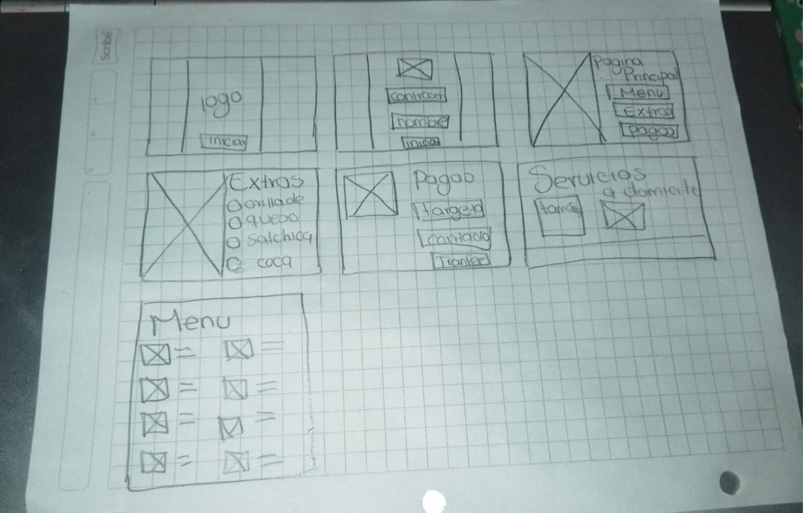

<h2>Documentación</h2>
            
Integradora (Proyecto de Sistemas Operativos, Aplicaciones Web)

            
Avryl Salas Hernandez

Adriana Rosales Gayosso

Karla Ivon Vargas Tavera

Daniel Gomez Hernandez

<h2>Misión</h2>
            
Ser una empresa innovadora, reconocida por ofrecer soluciones que transforma negocios y convertirnos en la primera opcion para nuestros clientes al buscar crecimiento y evolucion.

            
<h2>Valores</h2>
            
Somos una empresa responsable, organizada y apasionada al realizar cada proyecto que realizamos.

            
<h2>Objetivo</h2>
            
A través de una página web se puede ofrecer un servicio de pedido en línea a fin de reducir tiempos, mejorar el servicio y tener clientes satisfechos, así tendremos un control de los pedidos y una administración de cierto tiempo desde la página y atraer más clientes y fidelizarlos.

     
 <h2>Justificación</h2>
            
Cuando un cliente tiene antojo de comprar una pizza, en la región de Villa Ávila Camacho (la ceiba), la mayoría piensan en las pizzas GOMHER, por el tiempo que lleva en el mercado, y ha conseguido posicionarse en la comunidad, lo que buscamos es expandir y darnos a conocer entre los clientes, para ello diseñaremos una página web de la pizzería, que contará con lo necesario para ofrecer un pedido en línea con el fin de reducir los tiempos y nuestro objetivo es que nuestros clientes tengan una mejor comodidad al igual que el conocimiento de los diferentes tipos de pizzas, y seguridad al comprar en línea, brindando un mejor servicio al cliente.

        </section>

 <h2>Proyecto: pizzería</h2>
            
Tomamos en cuenta el negocio de los papás de nuestro compañero Daniel, ya que no tienen una publicidad y le quisimos ayudar a ese problema de acuerdo a una página web. Donde los clientes desde la página web puedan observar los diferentes tipos de pizza y el tiempo de su pedido.

            
Gracias a la información que nos asignó el campus pudimos comprender cada punto del documento y tuvimos un mejor análisis sobre nuestro proyecto y los diferentes procesos que debemos enfrentar antes de hacer nuestra página web.

<h2>Funcionalidades</h2>
            <ul>
                <li><strong>Diseño Web Personalizado:</strong> La empresa ofrece servicios de diseño web personalizados para reflejar la identidad única de cada negocio. Esto incluye la elección de colores, tipografías, imágenes y estructuras que mejor representen la marca del cliente.</li>
                <li><strong>Desarrollo Web:</strong> Utilizando tecnologías modernas y lenguajes de programación como HTML, CSS, JavaScript y frameworks como React o Angular, la empresa desarrolla sitios web funcionales y responsivos que se adaptan a diferentes dispositivos y tamaños de pantalla.</li>
                <li><strong>Gestión de Contenidos:</strong> Ofrecen sistemas de gestión de contenidos (CMS) como WordPress, que permiten a los propietarios de negocios actualizar y manejar su contenido de manera sencilla y sin necesidad de conocimientos técnicos profundos.</li>
                <li><strong>Integración de E-commerce:</strong> Para los negocios que venden productos o servicios en línea, la empresa puede integrar soluciones de comercio electrónico, como carritos de compra, pasarelas de pago seguras y gestión de inventarios.</li>
                <li><strong>Mantenimiento y Soporte Técnico:</strong> Proveen servicios de mantenimiento continuo para asegurar que los sitios web funcionen sin problemas, incluyendo actualizaciones de seguridad, copias de seguridad.</li>
                <li><strong>Marketing Digital:</strong> Ofrecen servicios adicionales de marketing digital, como la gestión de redes sociales, campañas de publicidad en línea (Google Ads, Facebook Ads), y marketing por correo electrónico para atraer y retener clientes.</li>
                <li><strong>Análisis
                </ul>
                            
<h2>Reglas de Negocio</h2>
 <ul>
                <li>Política de Privacidad: Utilización de datos con consentimiento explícito.</li>
                <li>Acceso a Datos Sensibles: Acceso restringido a datos sensibles.</li>
                <li>Actualización de Datos: Actualización periódica de datos.</li>
                <li>Uso Ético de Datos: Utilización de datos para mejorar experiencia de juego.</li>
                <li>Integridad de Datos: Medidas para asegurar integridad de datos.</li>
                <li>Compatibilidad de APIs: APIs compatibles con sistemas comunes.</li>
                <li>Notificación de Cambios: Comunicación clara sobre cambios.</li>
                <li>Cumplimiento Normativo de Juego: Seguir regulaciones de la industria.</li>
                <li>Soporte Técnico: Proceso eficiente de atención al cliente.</li> 
            </ul>
    
 <h2>Pizzería</h2>
  
Pizzas caseras GOMHER fundadas en 2015 es un negocio familiar que se basa en recetas tradicionales creadas por los mismos fundadores, buscando siempre sorprender a los paladares de los comensales, haciendo notar los inigualables sabores de pizzas, la pizzería trabaja en equipo para la mejor experiencia al comprar en la sucursal y al disfrutar de los productos.

        
<h2>Requerimientos funcionales</h2>
            <ul>
                <li>Gestión de menú.</li>
                <li>Proceso de pedido.</li>
                <li>Gestión de pedidos.</li>
                <li>Gestión de usuarios.</li>
                <li>Sistema de reseñas y calificaciones.</li>
            </ul>
           <h2>Requerimientos no funcionales</h2>
            <ul>
                <li>Rendimiento</li>
                <li>Utilidad</li>
                <li>Seguridad</li>
                <li>Localización</li>
                <li>Accesibilidad</li>
                <li>Disponibilidad</li>
            </ul>
             
 <h2>Alcance del producto</h2>
            
Llegar a más clientes, maximizando ganancias, este incremento será a nivel regional, las comunidades más cercanas a la sucursal, que sea más conocido y por parte de la empresa BROWSEweb ganar clientes que confíen en nuestro trabajo, ofreciendo efectividad, seguridad y profesionalismo.

           
<h2>Clases y características de usuarios</h2>
            <ul>
                <li><strong>Primarios/Desarrolladores:</strong>Somos nosotros, como empresa estamos comprometidos con que la pagina salga a flote de la mejor manera, escucharemos al cliente de acuerdo a lo que necesitara, también aconsejaremos de acuerdo a nuestra experiencia, mencionando que se podría hacer y hasta donde podemos contemplar.</li>
                <li><strong>Secundarios/Empresa que busca servicios de “Desarrolladores”:</strong>Son nuestros clientes, buscan impulsar su empresa al mundo digital, por lo regular ya tienen una esencia en el mercado, conocen a sus clientes, buscan maximizar sus ganancias y ofrecerles un mejor servicio y comodidad.</li>
                <li><strong>Terciarios/Usuarios de pagina :</strong>Son clientes de las empresas, interactúan con la página a través de las compras, pueden crear cuentas, solo podrán visualizar la información, no pueden modifican datos.</li>

<h2>Wireframes</h2>
            
Para desarrollar nuestro prototipo empleamos distintos bocetos por cada integrante de equipo para juntar ideas de cómo será la estructura y funcionalidad. Cada flecha representara la dirección que toma cada botón y la forma de como se desplazara el usuario por la página. 

            
En las siguientes imágenes se presentan las ideas con las que nos basamos para crear nuestro prototipo en el software XD, es una herramienta muy practica para desarrollar bocetos, a tal punto de tener una referencia de como funcionara.

            <h1>Nuestro Wireframes</h1>
            
            

 <h2>Prototipo o maquetado</h2>
            
Con basea nuestros bocetos fuimos juntando las ideas conservando una misma estructura haci creando un solo prototipo, que sea comprencible y vistosa para los usuarios, la paleta de colores es primordial para conservar la esencias del negocio, el tipo de letra, tamaño de imágenes, y demas cosas influyeron en nuestras opciones para tener una buena pagina. 

            <h1>Nuestro Maquetado</h1>
            
   

    

            
